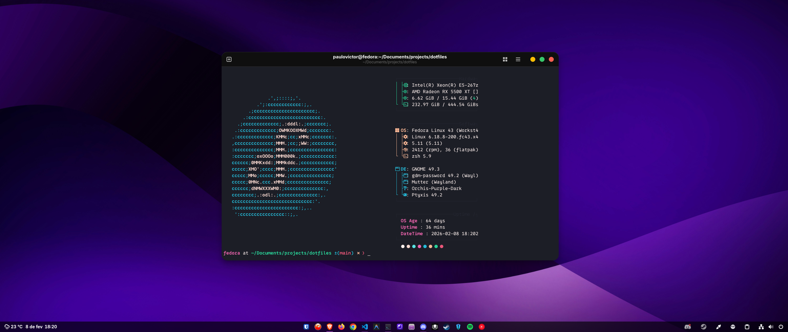

# Dotfiles

My linux dotfiles repository for personalizing and organizing my development environment, it includes **vscode**, **antigravity**, **terminal**, **themes** and more styles and settings, I'm always updating this repository, so the files may change a lot in the future.

## Preview

  

> My personal desktop customization.

## Hardware Specs

- **CPU:** Intel Xeon E5-2670 v3.
- **GPU:** AMD Radeon RX 5500 XT.
- **RAM:** 16 GB.
- **SSD:** 512 SATA.

## Development Environment

- **Operating System:** [Fedora Workstation](https://www.fedoraproject.org/) with _Gnome_.
- **Editor:** [Visual Studio Code](https://code.visualstudio.com/) and [Antigravity](https://www.antigravity.google/).
- **Terminal:** [Zsh](https://www.zsh.org/) with [Oh My Zsh](https://ohmyz.sh/).
- **Browser:** [Brave](https://brave.com/pt-br/) and [Firefox](https://www.firefox.com/pt-BR/).

## Fonts

- **Interface Text Font:** [Inter](https://fonts.google.com/specimen/Inter)
- **Monospaced Text Font:** [0xProto](https://github.com/0xType/0xProto)

## License

This is an open-source project licensed under the [MIT License](./LICENSE), which allows you to freely use, modify, and distribute the code.
