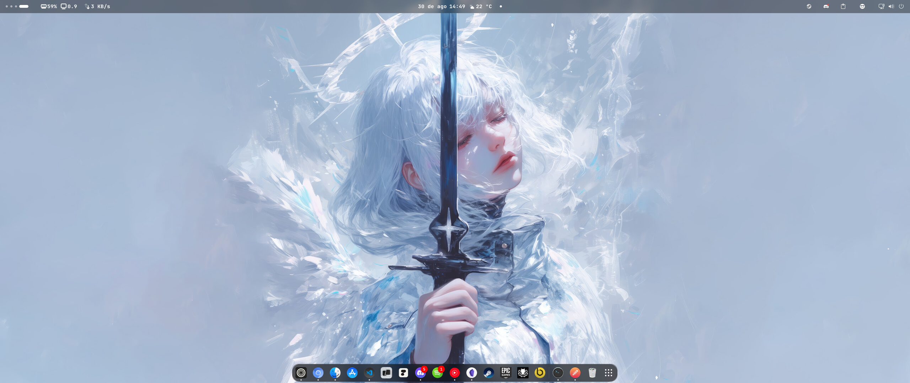
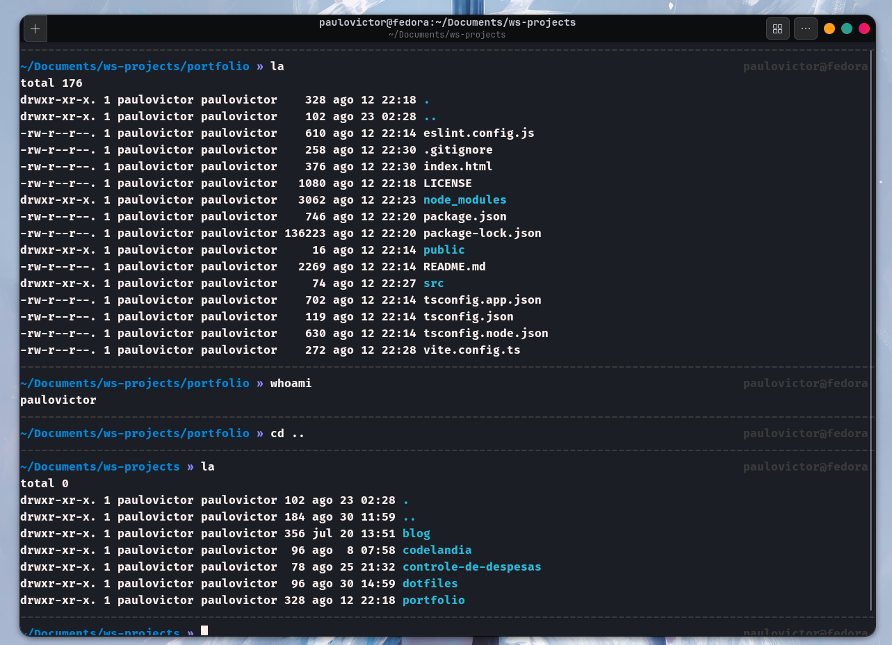
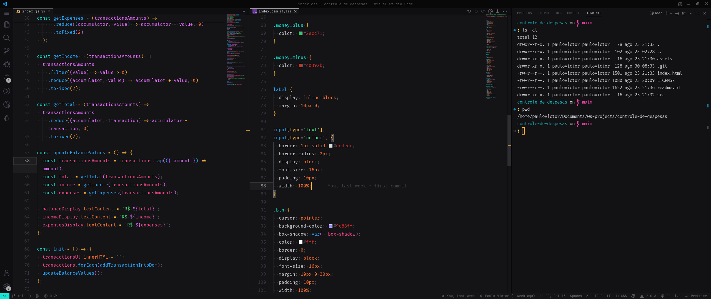
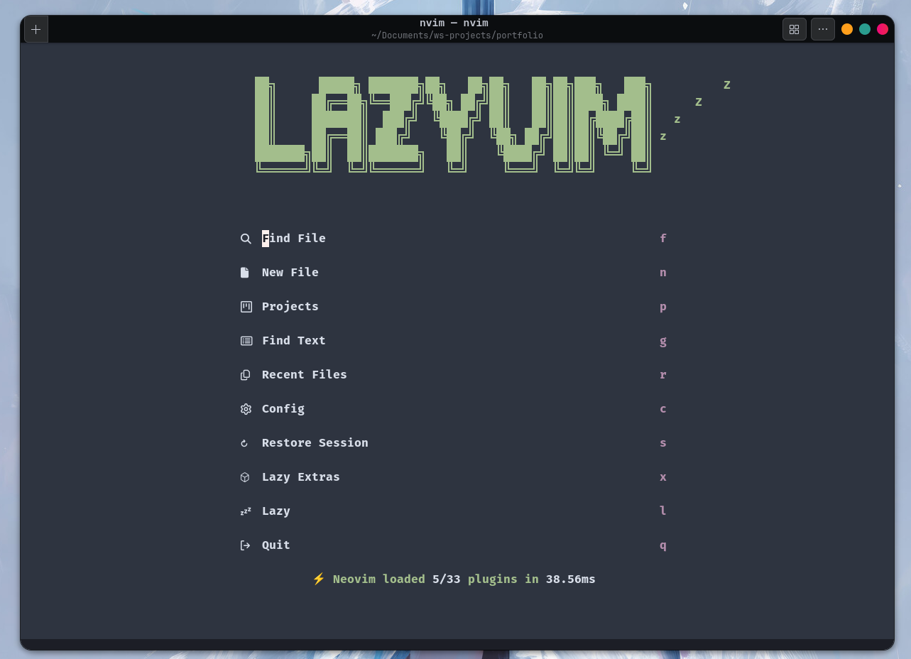

### 📂 Dotfiles

My dotfiles repository for personalizing and organizing my development environment, I'm always updating this repository, so the files may change a lot in the future.

### 🖥️ My Computer Specs

- **Intel Xeon E5-2670 v3** - CPU
- **16 GB** - RAM
- **512 SSD SATA** - Storage
- **AMD Radeon RX 5500 XT** - GPU

### 🧑‍💻 My Dev Setup

- **Editor:** [Visual Studio Code](https://code.visualstudio.com/) and [Lazyvim](https://www.lazyvim.org/) </br>
- **Operating System:** [Fedora 42 Workstation](https://www.fedoraproject.org/) (gnome) </br>
- **Terminal:** Bash and [Warp](https://www.warp.dev/) </br>
- **Shell:** [Zsh](https://www.zsh.org/) with [Oh My Zsh](https://ohmyz.sh/) </br>
- **Browser:** [Zen Browser](https://zenbrowser.com/) and [Chromium](https://www.google.com/chrome/canary/)</br>
- **Interface Text Font:** [JetBrainsMono Nerd Font](https://www.nerdfonts.com/font-downloads)</br>
- **Monospaced Text Font:** [IBM Plex Mono](https://fonts.google.com/specimen/IBM+Plex+Mono)

### 👀 Preview

<details>
<summary>Shell With Oh-My-Zsh Screenshot</summary>
<div align="center">
  
</div>
</details>

<details>
<summary>Vscode Screenshot</summary>
<div align="center">
  
</div>
</details>

<details>
<summary>Lazyvim Screenshot</summary>
<div align="center">
  
</div>
</details>

<details>
<summary>Wallpaper</summary>
<div align="center">
  
</div>
</details>

### 🤔 How to use

You can clone this repository to your local machine and customize it as you wish. Below are the steps to clone the repository:

```bash
# clone the repository
git clone https://github.com/paulopbi/dotfiles.git
# navigate to the dotfiles directory
cd ~/dotfiles
# see all the files
ls -a
```

after it you can copy the files to your home directory or create symbolic links to keep the files updated.

## 📄 License

You can see more about the license [right here](./LICENSE).
